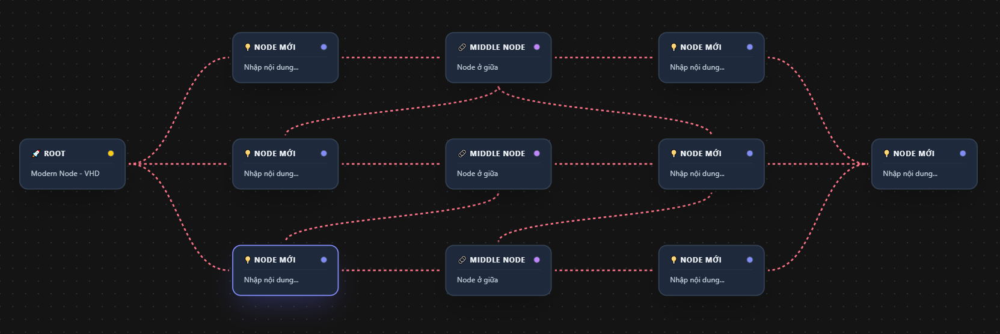

# 🚀 Modern Node - VHD

Một ứng dụng Web & PWA mạnh mẽ giúp vẽ sơ đồ tư duy (Mindmap), sơ đồ luồng (Flowchart) dựa trên kiến trúc Node-based hiện đại. Lấy cảm hứng từ các phần mềm chuyên nghiệp như ComfyUI nhưng được tối ưu hóa cho trải nghiệm mượt mà, giao diện bóng bẩy và dễ sử dụng trên cả Desktop lẫn Mobile.


## ✨ Tính năng nổi bật

- **🎨 Giao diện Glassmorphism:** Dark Mode cực kỳ bóng bẩy, hiện đại với các hiệu ứng pop-up animation mượt mà.
- **♾️ Infinite Canvas:** Bảng vẽ vô cực, phóng to/thu nhỏ không giới hạn (0.01x đến 100x).
- **🎛️ Tuỳ chỉnh Node tự do:** Đổi màu nền, đổi màu cổng nối (Dot), điều chỉnh giới hạn chiều rộng và hỗ trợ gõ văn bản dài tự động xuống dòng.
- **🔌 Kết nối linh hoạt:** Hỗ trợ cổng nối ở cả 4 cạnh (Trên, Dưới, Trái, Phải). Có thể bấm chuột phải vào đường dây để thêm Middle Node xen giữa hoặc cắt đứt dây.
- **💻 Tự động Layout:** Hỗ trợ sắp xếp sơ đồ tự động theo chiều Dọc (Top-Bottom) hoặc Ngang (Left-Right) với thuật toán Dagre.
- **📱 PWA Ready:** Hiển thị tràn viền (Fullscreen), có thể cài đặt trực tiếp vào điện thoại (iOS/Android) để sử dụng offline như một Native App.
- **☁️ Lưu trữ Đám mây (Firebase):** Tích hợp hệ thống Quản trị Admin, cho phép đẩy sơ đồ lên Cloud và tạo các Custom Alias Link (vd: `domain.com/vhd-ai`) để chia sẻ cho khách hàng xem ở chế độ View-Only.
- **📥 Import/Export:** Lưu sơ đồ dưới dạng file `.json` hoặc xuất nhanh ra file ảnh `.png`.

### 📸 Ảnh chụp màn hình Demo


*Giao diện làm việc chính trên Desktop*

## 🛠️ Cài đặt & Chạy trên máy tính (Local)

### 1. Tải mã nguồn
Clone kho lưu trữ này về máy tính của bạn:
```bash
git clone [https://github.com/thuanlyt/modern-node-app.git](https://github.com/thuanlyt/modern-node-app.git)
cd modern-node-vhd
```

### 2. Cài đặt thư viện
Dự án sử dụng Vite, React Flow và Vite PWA Plugin. Chạy lệnh sau để cài đặt:
```bash
npm install --legacy-peer-deps
```

### 3. Cấu hình Cơ sở dữ liệu (Firebase)
Dự án sử dụng Firebase Firestore để lưu trữ các link chia sẻ Public. Bạn cần tạo một dự án Firebase và lấy thông tin cấu hình.

Tạo một file có tên `.env` ở thư mục gốc của dự án và điền các thông tin sau (Thay thế bằng Key thực tế của bạn):
```env
VITE_FIREBASE_API_KEY="your-api-key"
VITE_FIREBASE_AUTH_DOMAIN="your-auth-domain"
VITE_FIREBASE_PROJECT_ID="your-project-id"
VITE_FIREBASE_STORAGE_BUCKET="your-storage-bucket"
VITE_FIREBASE_MESSAGING_SENDER_ID="your-sender-id"
VITE_FIREBASE_APP_ID="your-app-id"
```
*Lưu ý: File `.env` đã được đưa vào `.gitignore` để đảm bảo an toàn, không bị đẩy lên GitHub.*

### 4. Khởi chạy Server
Chạy lệnh sau để bật môi trường phát triển:
```bash
npm run dev
```
Mở trình duyệt và truy cập vào `http://localhost:5173`.

## ☁️ Triển khai (Deploy) lên Vercel

Ứng dụng này được thiết kế để tương thích hoàn hảo 100% với Vercel.

1. Đăng nhập vào [Vercel](https://vercel.com) và tạo Project mới từ Repo GitHub của bạn.
2. Vào phần **Settings > Environment Variables** của dự án trên Vercel.
3. Thêm lần lượt tất cả các biến môi trường có trong file `.env` của bạn vào đây.
4. Bấm **Deploy**. Vercel sẽ tự động cài đặt và cấp cho bạn một đường link HTTPS hoàn chỉnh để cài đặt PWA.

Hoặc deploy trực tiếp qua Vercel CLI:
```bash
npx vercel --prod
```

## 🔐 Quản trị viên (Admin)
- Mật khẩu mặc định để truy cập bảng Quản trị Cloud trên App là: `1234!@#$`
- Bạn có thể đổi mật khẩu này trực tiếp trong bảng Điều khiển Admin của ứng dụng.

---
**Phát triển bởi [ThuanLYT - VHD]** - *Mã nguồn mở phục vụ cộng đồng.*